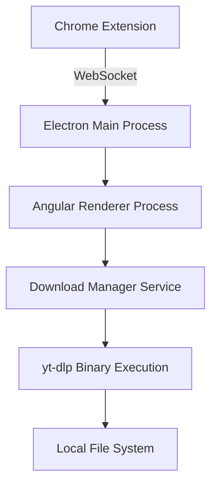

# StreamHelper Client Implementation Guide

## 🗺️ Project Context
**Primary Objective**: Desktop application for managing stream downloads from Chrome extension using yt-dlp  
**Key Features**:
- Real-time communication with browser extension via WebSocket
- Cross-platform yt-dlp binary management
- Download queue management with progress tracking
- User-friendly interface using Angular + PrimeNG

## 🏗️ System Architecture


## 🔧 Key Components

### 1. Electron Main Process Responsibilities
- WebSocket server management
- Inter-process communication (IPC)
- yt-dlp binary execution
- System-level operations (file access, notifications)

### 2. Angular Renderer Process Structure
```text
src/renderer/
├── app/
│   ├── services/
│   │   ├── download.service.ts       # Manages download queue
│   │   ├── websocket.service.ts      # Handles extension communication
│   │   └── config.service.ts         # Manages user preferences
│   ├── components/
│   │   ├── stream-list/              # Displays captured streams
│   │   ├── download-queue/           # Shows active downloads
│   │   └── settings/                 # Configuration interface
│   └── models/
│       └── download-item.model.ts    # Data structure for downloads
```

## 🌐 Communication Flow
1. Extension → Electron (WebSocket):
   ```json
   {
     "type": "STREAM_CAPTURED",
     "data": {
       "url": "m3u8-stream-url",
       "pageTitle": "Source Page Title",
       "timestamp": 1719504000
     }
   }
   ```
2. Electron → Angular (IPC):
   ```typescript
   // main.ts
   ipcMain.on('new-stream', (event, streamData) => {
     mainWindow.webContents.send('stream-update', streamData);
   });
   ```

## 🔑 Environment Configuration
```text
# .env
WEB_SOCKET_PORT=8080
MAX_CONCURRENT_DOWNLOADS=3
DEFAULT_DOWNLOAD_DIR=~/Downloads/StreamHelper
YTDLP_PATH=bin/${OS}/yt-dlp
```

## 🛠️ Development Scripts Cheatsheet
```bash
# Start all services concurrently
npm run start:all

# Generate new Angular component
ng generate component components/stream-list --skip-tests

# Debug main process
npm run electron:debug

# Package for current platform
npm run package:current

# Update yt-dlp binaries
npm run update-binaries
```

## 📚 Documentation Links
- [Angular Documentation](https://angular.io/docs)
- [PrimeNG Components](https://primeng.org/documentation)
- [Electron API Docs](https://www.electronjs.org/docs/latest)
- [yt-dlp Documentation](https://github.com/yt-dlp/yt-dlp/wiki)

## 🚨 Common Troubleshooting
| Issue                          | Solution                                  |
|--------------------------------|-------------------------------------------|
| Binary permission denied       | `chmod +x bin/darwin/yt-dlp`              |
| WebSocket connection failed    | Check firewall settings on port 8080      |
| PrimeNG themes not loading     | Import theme in angular.json styles array |
| IPC communication not working  | Ensure contextIsolation is false          |


## 📌 Important Notes for AI Assistants
1. **Pattern Matching**:
   - All services use `*.service.ts` suffix
   - Components follow `feature-name.component.ts` pattern
   - IPC channels use `kebab-case` naming (e.g., `download-progress`)

2. **Coding Standards**:
   ```typescript
   // Service method example
   /**
    * Adds stream to download queue
    * @param stream - Stream metadata from extension
    * @param priority - Download priority (0=normal)
    * @returns Queue position number
    */
   async enqueueStream(stream: StreamData, priority = 0): Promise<number> {
     // Implementation here
   }
   ```

3. **Areas Needing Attention**:
   - Binary path resolution for different platforms
   - WebSocket reconnection logic
   - Download progress parsing from yt-dlp output